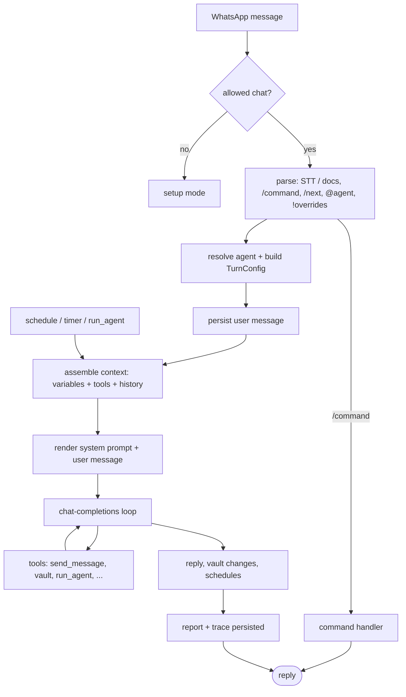

# Architecture

Klaus is a small loop around one idea: a WhatsApp message becomes a typed turn, the turn gathers vault context and tools, the model decides what to do, and durable state lands in the Obsidian vault or the local data store.

Scheduled runs, timers, persistence reschedules, and sub-agent calls (`run_agent`) skip the WhatsApp parse and enter the same execution path with a synthesised trigger.

There is no database and no hidden admin UI. Flat files carry all state: the Obsidian vault holds knowledge and user-owned configuration; the data directory holds operational stores.

## The three code zones

The whole of `src/` is three zones, each a coherent responsibility. They map one-to-one to the reference docs below.

| Zone | Path | Responsibility | Reload | Doc |
| --- | --- | --- | --- | --- |
| Pipeline | `src/pipeline/` | What happens during one turn: parse, config, context, templates, the model loop, reports, persistence. | restart | [pipeline.md](pipeline.md) |
| Primitives | `src/primitives/` | The pluggable pieces: tools, commands, variables (plus snippets and skills). | restart | [primitives.md](primitives.md) |
| Infra | `src/infra/` | External systems and state: config, vault + Obsidian sync, WhatsApp, the flat-file stores. | restart / hot | [infra.md](infra.md) |

Two cross-cutting concepts live where the code puts them rather than where you might expect:

- **Templates** are vault files (`Klaus/templates/*.md`) but the rendering logic is a pipeline file (`pipeline/templates.ts`). They are documented with the [pipeline](pipeline.md), not as a separate authoring surface.
- **Stores** (`history`, `files`, `schedules`, `timers`) live inside `infra/store/` and are documented with [infra](infra.md).

**Agents** are technically a pipeline concept (`pipeline/agents.ts` resolves them), but because they are the single thing you author most, they get [their own page](agents.md).

## Authoring surfaces

Most tinkering happens in three places, by reload speed:

| Surface | Use | Reload |
| --- | --- | --- |
| WhatsApp | Route messages, run commands, arm `/next`, apply one-turn `!overrides`. | immediate |
| `{vault}/Klaus/` | Agents, snippets, skills, templates, `settings.yml`, `overrides.yml`. | hot |
| `src/` | New tools, commands, variables, or pipeline behaviour. | restart |

The repo `vault/` directory is only the first-run template. On first boot Klaus copies it to `{vault}/Klaus/` and from then on reads and watches the user's copy. Once `{vault}/Klaus/` exists it is user-owned: Klaus never merges defaults into it or backfills files. See [infra.md](infra.md#vault) for the sync and hot-reload model.

---
---
---
---
---
## [Continue to Usage](usage.md)
